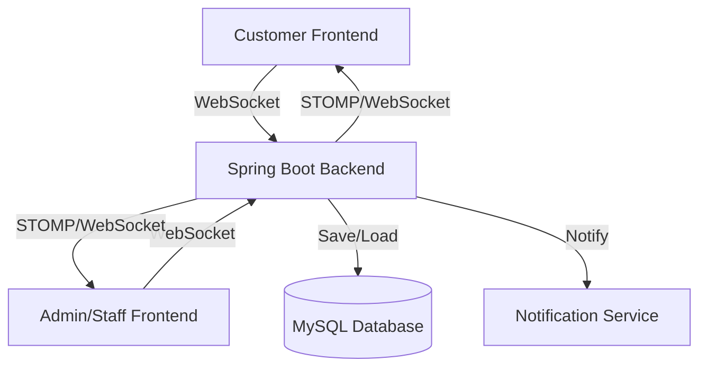

# 💬 Kế Hoạch Triển Khai Tính Năng Chat Chăm Sóc Khách Hàng

## 📋 Tổng Quan

Triển khai hệ thống chat real-time giữa khách hàng và staff/admin với đầy đủ tính năng:
- ✅ Real-time messaging với WebSocket
- ✅ Hiển thị tên staff/admin đang chat
- ✅ Typing indicator (đang gõ...)
- ✅ Seen status (đã xem)
- ✅ File upload (hình ảnh, file đính kèm)
- ✅ Emoji support
- ✅ Chat history
- ✅ Online/Offline status
- ✅ Notification badges

---

## 🏗️ Kiến Trúc Hệ Thống

### Luồng Hoạt Động



### Tech Stack

**Backend:**
- Spring Boot WebSocket
- STOMP Protocol
- SockJS (fallback cho browsers không support WebSocket)
- Spring Security integration
- MySQL cho message persistence

**Frontend:**
- React
- Socket.IO Client hoặc STOMP.js
- Material-UI cho chat components
- React Context cho chat state management

---

## 🗄️ Database Schema

### 1. Bảng `chat_conversations`

Lưu trữ các cuộc hội thoại giữa customer và staff.

```sql
CREATE TABLE chat_conversations (
    id BINARY(16) PRIMARY KEY DEFAULT (UUID_TO_BIN(UUID())),
    customer_id BINARY(16) NOT NULL,
    assigned_staff_id BINARY(16) NULL,
    status ENUM('ACTIVE', 'CLOSED', 'WAITING') DEFAULT 'WAITING',
    last_message_at TIMESTAMP NULL,
    created_at TIMESTAMP DEFAULT CURRENT_TIMESTAMP,
    updated_at TIMESTAMP DEFAULT CURRENT_TIMESTAMP ON UPDATE CURRENT_TIMESTAMP,
    closed_at TIMESTAMP NULL,
    
    CONSTRAINT fk_conversation_customer FOREIGN KEY (customer_id) 
        REFERENCES customers(id) ON DELETE CASCADE,
    CONSTRAINT fk_conversation_staff FOREIGN KEY (assigned_staff_id) 
        REFERENCES staff_accounts(id) ON DELETE SET NULL,
        
    INDEX idx_customer_id (customer_id),
    INDEX idx_staff_id (assigned_staff_id),
    INDEX idx_status (status),
    INDEX idx_last_message (last_message_at DESC)
) ENGINE=InnoDB DEFAULT CHARSET=utf8mb4 COLLATE=utf8mb4_unicode_ci;
```

### 2. Bảng `chat_messages`

Lưu trữ tất cả tin nhắn trong conversation.

```sql
CREATE TABLE chat_messages (
    id BINARY(16) PRIMARY KEY DEFAULT (UUID_TO_BIN(UUID())),
    conversation_id BINARY(16) NOT NULL,
    sender_type ENUM('CUSTOMER', 'STAFF') NOT NULL,
    sender_id BINARY(16) NOT NULL,
    message_type ENUM('TEXT', 'IMAGE', 'FILE', 'SYSTEM') DEFAULT 'TEXT',
    content TEXT NOT NULL,
    attachment_url VARCHAR(500) NULL,
    attachment_name VARCHAR(255) NULL,
    attachment_size BIGINT NULL,
    is_read BOOLEAN DEFAULT FALSE,
    read_at TIMESTAMP NULL,
    created_at TIMESTAMP DEFAULT CURRENT_TIMESTAMP,
    
    CONSTRAINT fk_message_conversation FOREIGN KEY (conversation_id) 
        REFERENCES chat_conversations(id) ON DELETE CASCADE,
        
    INDEX idx_conversation_id (conversation_id),
    INDEX idx_created_at (created_at DESC),
    INDEX idx_is_read (is_read),
    INDEX idx_sender (sender_type, sender_id)
) ENGINE=InnoDB DEFAULT CHARSET=utf8mb4 COLLATE=utf8mb4_unicode_ci;
```

### 3. Bảng `chat_typing_indicators`

Lưu trữ trạng thái đang gõ (có thể dùng Redis thay vì MySQL cho performance tốt hơn).

```sql
CREATE TABLE chat_typing_indicators (
    id BINARY(16) PRIMARY KEY DEFAULT (UUID_TO_BIN(UUID())),
    conversation_id BINARY(16) NOT NULL,
    user_type ENUM('CUSTOMER', 'STAFF') NOT NULL,
    user_id BINARY(16) NOT NULL,
    is_typing BOOLEAN DEFAULT FALSE,
    updated_at TIMESTAMP DEFAULT CURRENT_TIMESTAMP ON UPDATE CURRENT_TIMESTAMP,
    
    CONSTRAINT fk_typing_conversation FOREIGN KEY (conversation_id) 
        REFERENCES chat_conversations(id) ON DELETE CASCADE,
        
    UNIQUE INDEX idx_conversation_user (conversation_id, user_type, user_id),
    INDEX idx_updated_at (updated_at)
) ENGINE=InnoDB DEFAULT CHARSET=utf8mb4 COLLATE=utf8mb4_unicode_ci;
```

### 4. Bảng `chat_participants`

Lưu trữ thông tin người tham gia conversation (optional, nếu muốn support group chat sau này).

```sql
CREATE TABLE chat_participants (
    id BINARY(16) PRIMARY KEY DEFAULT (UUID_TO_BIN(UUID())),
    conversation_id BINARY(16) NOT NULL,
    participant_type ENUM('CUSTOMER', 'STAFF') NOT NULL,
    participant_id BINARY(16) NOT NULL,
    joined_at TIMESTAMP DEFAULT CURRENT_TIMESTAMP,
    last_seen_at TIMESTAMP NULL,
    unread_count INT DEFAULT 0,
    
    CONSTRAINT fk_participant_conversation FOREIGN KEY (conversation_id) 
        REFERENCES chat_conversations(id) ON DELETE CASCADE,
        
    UNIQUE INDEX idx_conversation_participant (conversation_id, participant_type, participant_id),
    INDEX idx_participant (participant_type, participant_id)
) ENGINE=InnoDB DEFAULT CHARSET=utf8mb4 COLLATE=utf8mb4_unicode_ci;
```

---

## 🔧 Backend Implementation

### Phase 1: Dependencies (pom.xml)

```xml
<!-- WebSocket Support -->
<dependency>
    <groupId>org.springframework.boot</groupId>
    <artifactId>spring-boot-starter-websocket</artifactId>
</dependency>

<!-- STOMP Messaging -->
<dependency>
    <groupId>org.springframework</groupId>
    <artifactId>spring-messaging</artifactId>
</dependency>

<!-- SockJS (WebSocket fallback) -->
<dependency>
    <groupId>org.webjars</groupId>
    <artifactId>sockjs-client</artifactId>
    <version>1.5.1</version>
</dependency>

<!-- STOMP WebSocket -->
<dependency>
    <groupId>org.webjars</groupId>
    <artifactId>stomp-websocket</artifactId>
    <version>2.3.4</version>
</dependency>

<!-- Optional: Redis for typing indicators & online status -->
<dependency>
    <groupId>org.springframework.boot</groupId>
    <artifactId>spring-boot-starter-data-redis</artifactId>
</dependency>
```

### Phase 2: Entity Classes

**File:** `bonlai/src/main/java/com/hoangduyminh/exercise201/entity/ChatConversation.java`

```java
@Entity
@Table(name = "chat_conversations")
@Data
@NoArgsConstructor
@AllArgsConstructor
public class ChatConversation extends BaseEntity {
    
    @ManyToOne(fetch = FetchType.LAZY)
    @JoinColumn(name = "customer_id", nullable = false)
    private Customer customer;
    
    @ManyToOne(fetch = FetchType.LAZY)
    @JoinColumn(name = "assigned_staff_id")
    private StaffAccount assignedStaff;
    
    @Enumerated(EnumType.STRING)
    @Column(nullable = false)
    private ConversationStatus status = ConversationStatus.WAITING;
    
    @Column(name = "last_message_at")
    private LocalDateTime lastMessageAt;
    
    @Column(name = "closed_at")
    private LocalDateTime closedAt;
    
    @OneToMany(mappedBy = "conversation", cascade = CascadeType.ALL)
    private List<ChatMessage> messages = new ArrayList<>();
    
    public enum ConversationStatus {
        ACTIVE,     // Đang chat
        CLOSED,     // Đã đóng
        WAITING     // Chờ staff nhận
    }
}
```

**File:** `bonlai/src/main/java/com/hoangduyminh/exercise201/entity/ChatMessage.java`

```java
@Entity
@Table(name = "chat_messages")
@Data
@NoArgsConstructor
@AllArgsConstructor
public class ChatMessage extends BaseEntity {
    
    @ManyToOne(fetch = FetchType.LAZY)
    @JoinColumn(name = "conversation_id", nullable = false)
    private ChatConversation conversation;
    
    @Enumerated(EnumType.STRING)
    @Column(name = "sender_type", nullable = false)
    private SenderType senderType;
    
    @Column(name = "sender_id", nullable = false)
    private UUID senderId;
    
    @Enumerated(EnumType.STRING)
    @Column(name = "message_type")
    private MessageType messageType = MessageType.TEXT;
    
    @Column(columnDefinition = "TEXT", nullable = false)
    private String content;
    
    @Column(name = "attachment_url", length = 500)
    private String attachmentUrl;
    
    @Column(name = "attachment_name")
    private String attachmentName;
    
    @Column(name = "attachment_size")
    private Long attachmentSize;
    
    @Column(name = "is_read")
    private Boolean isRead = false;
    
    @Column(name = "read_at")
    private LocalDateTime readAt;
    
    // Transient fields for response
    @Transient
    private String senderName;
    
    @Transient
    private String senderAvatar;
    
    public enum SenderType {
        CUSTOMER,
        STAFF
    }
    
    public enum MessageType {
        TEXT,
        IMAGE,
        FILE,
        SYSTEM
    }
}
```

### Phase 3: WebSocket Configuration

**File:** `bonlai/src/main/java/com/hoangduyminh/exercise201/config/WebSocketConfig.java`

```java
@Configuration
@EnableWebSocketMessageBroker
public class WebSocketConfig implements WebSocketMessageBrokerConfigurer {
    
    @Override
    public void configureMessageBroker(MessageBrokerRegistry config) {
        // Enable simple broker for pub/sub
        config.enableSimpleBroker("/topic", "/queue");
        
        // Prefix for messages from client
        config.setApplicationDestinationPrefixes("/app");
        
        // Prefix for user-specific messages
        config.setUserDestinationPrefix("/user");
    }
    
    @Override
    public void registerStompEndpoints(StompEndpointRegistry registry) {
        registry.addEndpoint("/ws")
                .setAllowedOriginPatterns("*")
                .withSockJS();
    }
    
    @Override
    public void configureClientInboundChannel(ChannelRegistration registration) {
        registration.interceptors(new ChannelInterceptor() {
            @Override
            public Message<?> preSend(Message<?> message, MessageChannel channel) {
                StompHeaderAccessor accessor = 
                    MessageHeaderAccessor.getAccessor(message, StompHeaderAccessor.class);
                
                if (StompCommand.CONNECT.equals(accessor.getCommand())) {
                    // Extract JWT token from header and authenticate
                    String authToken = accessor.getFirstNativeHeader("Authorization");
                    if (authToken != null && authToken.startsWith("Bearer ")) {
                        // Validate JWT and set user principal
                        // Implementation here...
                    }
                }
                return message;
            }
        });
    }
}
```

### Phase 4: WebSocket Controller

**File:** `bonlai/src/main/java/com/hoangduyminh/exercise201/controller/ChatWebSocketController.java`

```java
@Controller
@RequiredArgsConstructor
@Slf4j
public class ChatWebSocketController {
    
    private final ChatService chatService;
    private final SimpMessagingTemplate messagingTemplate;
    
    @MessageMapping("/chat/send")
    @SendTo("/topic/messages")
    public ChatMessageDTO sendMessage(
            @Payload ChatMessageDTO messageDTO,
            Principal principal
    ) {
        log.info("Received message from {}: {}", principal.getName(), messageDTO.getContent());
        
        // Save message to database
        ChatMessage savedMessage = chatService.sendMessage(messageDTO, principal);
        
        // Broadcast to conversation participants
        messagingTemplate.convertAndSend(
            "/topic/conversation/" + savedMessage.getConversation().getId(),
            ChatMessageDTO.fromEntity(savedMessage)
        );
        
        return ChatMessageDTO.fromEntity(savedMessage);
    }
    
    @MessageMapping("/chat/typing")
    public void handleTypingIndicator(
            @Payload TypingIndicatorDTO typingDTO,
            Principal principal
    ) {
        // Broadcast typing status to other participants
        messagingTemplate.convertAndSend(
            "/topic/conversation/" + typingDTO.getConversationId() + "/typing",
            typingDTO
        );
    }
    
    @MessageMapping("/chat/read")
    public void markMessagesAsRead(
            @Payload ReadReceiptDTO readDTO,
            Principal principal
    ) {
        chatService.markMessagesAsRead(readDTO.getConversationId(), principal);
        
        // Notify sender that messages were read
        messagingTemplate.convertAndSend(
            "/topic/conversation/" + readDTO.getConversationId() + "/read",
            readDTO
        );
    }
}
```

### Phase 5: REST API Endpoints

**File:** `bonlai/src/main/java/com/hoangduyminh/exercise201/controller/ChatController.java`

```java
@RestController
@RequestMapping("/api/chat")
@RequiredArgsConstructor
public class ChatController {
    
    private final ChatService chatService;
    
    // Get or create conversation for customer
    @PostMapping("/conversations/start")
    public ResponseEntity<ConversationDTO> startConversation() {
        ConversationDTO conversation = chatService.startConversation();
        return ResponseEntity.ok(conversation);
    }
    
    // Get all conversations for staff/admin
    @GetMapping("/conversations")
    public ResponseEntity<Page<ConversationDTO>> getConversations(
            @RequestParam(defaultValue = "0") int page,
            @RequestParam(defaultValue = "20") int size,
            @RequestParam(required = false) String status
    ) {
        Page<ConversationDTO> conversations = 
            chatService.getConversations(page, size, status);
        return ResponseEntity.ok(conversations);
    }
    
    // Get conversation by ID
    @GetMapping("/conversations/{conversationId}")
    public ResponseEntity<ConversationDTO> getConversation(
            @PathVariable UUID conversationId
    ) {
        ConversationDTO conversation = chatService.getConversation(conversationId);
        return ResponseEntity.ok(conversation);
    }
    
    // Get messages in conversation
    @GetMapping("/conversations/{conversationId}/messages")
    public ResponseEntity<Page<ChatMessageDTO>> getMessages(
            @PathVariable UUID conversationId,
            @RequestParam(defaultValue = "0") int page,
            @RequestParam(defaultValue = "50") int size
    ) {
        Page<ChatMessageDTO> messages = 
            chatService.getMessages(conversationId, page, size);
        return ResponseEntity.ok(messages);
    }
    
    // Send message via REST (fallback if WebSocket fails)
    @PostMapping("/messages")
    public ResponseEntity<ChatMessageDTO> sendMessageREST(
            @Valid @RequestBody ChatMessageDTO messageDTO
    ) {
        ChatMessageDTO savedMessage = chatService.sendMessageREST(messageDTO);
        return ResponseEntity.ok(savedMessage);
    }
    
    // Upload file for chat
    @PostMapping("/upload")
    public ResponseEntity<FileUploadResponse> uploadFile(
            @RequestParam("file") MultipartFile file,
            @RequestParam("conversationId") UUID conversationId
    ) {
        FileUploadResponse response = chatService.uploadFile(file, conversationId);
        return ResponseEntity.ok(response);
    }
    
    // Assign conversation to staff
    @PutMapping("/conversations/{conversationId}/assign")
    public ResponseEntity<ConversationDTO> assignConversation(
            @PathVariable UUID conversationId
    ) {
        ConversationDTO conversation = chatService.assignToCurrentStaff(conversationId);
        return ResponseEntity.ok(conversation);
    }
    
    // Close conversation
    @PutMapping("/conversations/{conversationId}/close")
    public ResponseEntity<ConversationDTO> closeConversation(
            @PathVariable UUID conversationId
    ) {
        ConversationDTO conversation = chatService.closeConversation(conversationId);
        return ResponseEntity.ok(conversation);
    }
    
    // Get unread count
    @GetMapping("/unread-count")
    public ResponseEntity<Map<String, Integer>> getUnreadCount() {
        int unreadCount = chatService.getUnreadCount();
        return ResponseEntity.ok(Map.of("unreadCount", unreadCount));
    }
}
```

---

## 💻 Frontend Implementation

### Phase 1: Dependencies (package.json)

```json
{
  "dependencies": {
    "sockjs-client": "^1.6.1",
    "@stomp/stompjs": "^7.0.0",
    "emoji-picker-react": "^4.5.0",
    "react-dropzone": "^14.2.3",
    "dayjs": "^1.11.10"
  }
}
```

### Phase 2: WebSocket Service

**File:** `frontendbonlai/src/services/ChatWebSocketService.js`

```javascript
import { Client } from '@stomp/stompjs';
import SockJS from 'sockjs-client';
import { getAuthToken } from '../utils/storage';

class ChatWebSocketService {
  constructor() {
    this.client = null;
    this.connected = false;
    this.subscriptions = new Map();
  }

  connect(onConnected, onError) {
    const token = getAuthToken();
    
    this.client = new Client({
      webSocketFactory: () => new SockJS('http://localhost:8080/ws'),
      connectHeaders: {
        Authorization: token
      },
      debug: (str) => {
        console.log('STOMP Debug:', str);
      },
      reconnectDelay: 5000,
      heartbeatIncoming: 4000,
      heartbeatOutgoing: 4000,
      onConnect: () => {
        console.log('WebSocket Connected');
        this.connected = true;
        if (onConnected) onConnected();
      },
      onStompError: (frame) => {
        console.error('STOMP error:', frame);
        this.connected = false;
        if (onError) onError(frame);
      },
      onWebSocketClose: () => {
        console.log('WebSocket Closed');
        this.connected = false;
      }
    });

    this.client.activate();
  }

  disconnect() {
    if (this.client) {
      this.subscriptions.forEach(sub => sub.unsubscribe());
      this.subscriptions.clear();
      this.client.deactivate();
      this.connected = false;
    }
  }

  subscribeToConversation(conversationId, messageCallback, typingCallback, readCallback) {
    if (!this.connected) {
      console.error('WebSocket not connected');
      return;
    }

    // Subscribe to messages
    const messageSub = this.client.subscribe(
      `/topic/conversation/${conversationId}`,
      (message) => {
        const data = JSON.parse(message.body);
        messageCallback(data);
      }
    );

    // Subscribe to typing indicators
    const typingSub = this.client.subscribe(
      `/topic/conversation/${conversationId}/typing`,
      (message) => {
        const data = JSON.parse(message.body);
        typingCallback(data);
      }
    );

    // Subscribe to read receipts
    const readSub = this.client.subscribe(
      `/topic/conversation/${conversationId}/read`,
      (message) => {
        const data = JSON.parse(message.body);
        readCallback(data);
      }
    );

    this.subscriptions.set(`conversation-${conversationId}`, {
      messageSub,
      typingSub,
      readSub,
      unsubscribe: () => {
        messageSub.unsubscribe();
        typingSub.unsubscribe();
        readSub.unsubscribe();
      }
    });
  }

  unsubscribeFromConversation(conversationId) {
    const sub = this.subscriptions.get(`conversation-${conversationId}`);
    if (sub) {
      sub.unsubscribe();
      this.subscriptions.delete(`conversation-${conversationId}`);
    }
  }

  sendMessage(conversationId, content, messageType = 'TEXT', attachmentUrl = null) {
    if (!this.connected) {
      throw new Error('WebSocket not connected');
    }

    this.client.publish({
      destination: '/app/chat/send',
      body: JSON.stringify({
        conversationId,
        content,
        messageType,
        attachmentUrl
      })
    });
  }

  sendTypingIndicator(conversationId, isTyping) {
    if (!this.connected) return;

    this.client.publish({
      destination: '/app/chat/typing',
      body: JSON.stringify({
        conversationId,
        isTyping
      })
    });
  }

  markAsRead(conversationId, messageIds) {
    if (!this.connected) return;

    this.client.publish({
      destination: '/app/chat/read',
      body: JSON.stringify({
        conversationId,
        messageIds
      })
    });
  }
}

export default new ChatWebSocketService();
```

### Phase 3: Chat Context

**File:** `frontendbonlai/src/context/ChatContext.jsx`

```javascript
import React, { createContext, useContext, useState, useEffect, useCallback } from 'react';
import ChatWebSocketService from '../services/ChatWebSocketService';
import { chatAPI } from '../api/chatAPI';

const ChatContext = createContext(null);

export const useChatContext = () => {
  const context = useContext(ChatContext);
  if (!context) {
    throw new Error('useChatContext must be used within ChatProvider');
  }
  return context;
};

export const ChatProvider = ({ children }) => {
  const [connected, setConnected] = useState(false);
  const [conversations, setConversations] = useState([]);
  const [currentConversation, setCurrentConversation] = useState(null);
  const [messages, setMessages] = useState([]);
  const [typingUsers, setTypingUsers] = useState(new Map());
  const [unreadCount, setUnreadCount] = useState(0);

  useEffect(() => {
    // Connect to WebSocket
    ChatWebSocketService.connect(
      () => {
        console.log('Chat WebSocket connected');
        setConnected(true);
        loadConversations();
        loadUnreadCount();
      },
      (error) => {
        console.error('Chat WebSocket error:', error);
        setConnected(false);
      }
    );

    return () => {
      ChatWebSocketService.disconnect();
    };
  }, []);

  const loadConversations = async () => {
    try {
      const response = await chatAPI.getConversations();
      setConversations(response.data.content);
    } catch (error) {
      console.error('Error loading conversations:', error);
    }
  };

  const loadUnreadCount = async () => {
    try {
      const response = await chatAPI.getUnreadCount();
      setUnreadCount(response.data.unreadCount);
    } catch (error) {
      console.error('Error loading unread count:', error);
    }
  };

  const startConversation = async () => {
    try {
      const response = await chatAPI.startConversation();
      const conversation = response.data;
      setCurrentConversation(conversation);
      subscribeToConversation(conversation.id);
      return conversation;
    } catch (error) {
      console.error('Error starting conversation:', error);
      throw error;
    }
  };

  const loadMessages = async (conversationId) => {
    try {
      const response = await chatAPI.getMessages(conversationId);
      setMessages(response.data.content);
    } catch (error) {
      console.error('Error loading messages:', error);
    }
  };

  const subscribeToConversation = (conversationId) => {
    ChatWebSocketService.subscribeToConversation(
      conversationId,
      (message) => {
        // New message received
        setMessages(prev => [...prev, message]);
        setConversations(prev => 
          prev.map(conv => 
            conv.id === conversationId 
              ? { ...conv, lastMessage: message, lastMessageAt: message.createdAt }
              : conv
          )
        );
      },
      (typing) => {
        // Typing indicator
        setTypingUsers(prev => {
          const next = new Map(prev);
          if (typing.isTyping) {
            next.set(typing.userId, typing);
          } else {
            next.delete(typing.userId);
          }
          return next;
        });
      },
      (read) => {
        // Read receipt
        setMessages(prev =>
          prev.map(msg =>
            read.messageIds.includes(msg.id)
              ? { ...msg, isRead: true, readAt: read.readAt }
              : msg
          )
        );
      }
    );
  };

  const sendMessage = async (content, messageType = 'TEXT', attachmentUrl = null) => {
    if (!currentConversation) return;

    try {
      ChatWebSocketService.sendMessage(
        currentConversation.id,
        content,
        messageType,
        attachmentUrl
      );
    } catch (error) {
      console.error('Error sending message:', error);
      throw error;
    }
  };

  const sendTyping = (isTyping) => {
    if (!currentConversation) return;
    ChatWebSocketService.sendTypingIndicator(currentConversation.id, isTyping);
  };

  const markAsRead = async (messageIds) => {
    if (!currentConversation) return;
    
    try {
      ChatWebSocketService.markAsRead(currentConversation.id, messageIds);
      await loadUnreadCount();
    } catch (error) {
      console.error('Error marking as read:', error);
    }
  };

  const uploadFile = async (file) => {
    if (!currentConversation) return;

    try {
      const response = await chatAPI.uploadFile(file, currentConversation.id);
      return response.data;
    } catch (error) {
      console.error('Error uploading file:', error);
      throw error;
    }
  };

  const value = {
    connected,
    conversations,
    currentConversation,
    messages,
    typingUsers,
    unreadCount,
    startConversation,
    setCurrentConversation,
    loadMessages,
    sendMessage,
    sendTyping,
    markAsRead,
    uploadFile,
    loadConversations,
    subscribeToConversation
  };

  return (
    <ChatContext.Provider value={value}>
      {children}
    </ChatContext.Provider>
  );
};
```

### Phase 4: Chat Components

**Cấu trúc components:**

```
frontendbonlai/src/
├── components/
│   └── chat/
│       ├── ChatWidget.jsx              # Floating chat button (for customers)
│       ├── ChatWindow.jsx              # Main chat window
│       ├── MessageList.jsx             # List of messages
│       ├── MessageItem.jsx             # Single message component
│       ├── MessageInput.jsx            # Input area with emoji & file upload
│       ├── TypingIndicator.jsx         # "User is typing..." indicator
│       ├── FileUpload.jsx              # File upload component
│       ├── EmojiPicker.jsx             # Emoji picker
│       └── ChatNotification.jsx        # Notification badge
│
├── admin/pages/chat/
│   ├── ChatDashboard.jsx               # Admin chat dashboard
│   ├── ConversationList.jsx            # List of all conversations
│   ├── ConversationItem.jsx            # Single conversation item
│   └── StaffChatWindow.jsx             # Chat window for staff
│
└── user/pages/
    └── CustomerChat.jsx                 # Customer chat page
```

**Sample Component:** `ChatWidget.jsx`

```javascript
import React, { useState } from 'react';
import { Fab, Badge } from '@mui/material';
import { Chat as ChatIcon } from '@mui/icons-material';
import ChatWindow from './ChatWindow';
import { useChatContext } from '../../context/ChatContext';

const ChatWidget = () => {
  const [open, setOpen] = useState(false);
  const { unreadCount, startConversation } = useChatContext();

  const handleOpen = async () => {
    if (!open) {
      await startConversation();
    }
    setOpen(true);
  };

  return (
    <>
      <Fab
        color="primary"
        aria-label="chat"
        onClick={handleOpen}
        sx={{
          position: 'fixed',
          bottom: 20,
          right: 20,
          zIndex: 1000
        }}
      >
        <Badge badgeContent={unreadCount} color="error">
          <ChatIcon />
        </Badge>
      </Fab>

      {open && (
        <ChatWindow
          open={open}
          onClose={() => setOpen(false)}
        />
      )}
    </>
  );
};

export default ChatWidget;
```

---

## 📝 Implementation Roadmap

### Sprint 1: Backend Foundation (5-7 days)
- [ ] Tạo database schema cho chat tables
- [ ] Tạo Entity classes (ChatConversation, ChatMessage)
- [ ] Tạo Repository interfaces
- [ ] Tạo basic Service layer
- [ ] Setup WebSocket configuration
- [ ] Tạo WebSocket controller
- [ ] Test WebSocket connection

### Sprint 2: Backend Features (7-10 days)
- [ ] Implement REST API endpoints
- [ ] Implement message sending/receiving
- [ ] Implement typing indicators
- [ ] Implement read receipts
- [ ] Implement file upload
- [ ] Implement conversation assignment
- [ ] Add JWT authentication to WebSocket
- [ ] Write unit tests

### Sprint 3: Frontend Foundation (5-7 days)
- [ ] Setup WebSocket service
- [ ] Create Chat Context
- [ ] Create basic chat components
- [ ] Implement message list
- [ ] Implement message input
- [ ] Test WebSocket connection

### Sprint 4: Frontend Features (7-10 days)
- [ ] Implement typing indicator
- [ ] Implement read receipts
- [ ] Implement emoji picker
- [ ] Implement file upload UI
- [ ] Implement notification badge
- [ ] Create admin chat dashboard
- [ ] Create customer chat widget
- [ ] Polish UI/UX

### Sprint 5: Testing & Polish (5-7 days)
- [ ] Integration testing
- [ ] UI/UX testing
- [ ] Performance testing
- [ ] Bug fixes
- [ ] Documentation
- [ ] Deployment preparation

**Total: 4-6 tuần (20-34 ngày làm việc)**

---

## 🔍 Technical Considerations

### 1. Scalability
- **Current:** Simple in-memory STOMP broker
- **Future:** Redis pub/sub hoặc RabbitMQ cho production
- **Database:** Index optimization cho query performance
- **Caching:** Redis cho typing indicators và online status

### 2. Security
- JWT authentication cho WebSocket connections
- Validate user permissions trước khi send/read messages
- XSS protection cho message content
- File upload validation (size, type)
- Rate limiting cho message sending

### 3. Performance
- Pagination cho message history
- Lazy loading cho old messages
- Image compression trước khi upload
- WebSocket connection pooling
- Database query optimization

### 4. Monitoring
- WebSocket connection metrics
- Message delivery rate
- Error tracking
- User online/offline tracking
- Response time monitoring

---

## 🧪 Testing Strategy

### Backend Testing
```java
@SpringBootTest
@AutoConfigureMockMvc
class ChatWebSocketControllerTest {
    
    @Test
    void shouldConnectToWebSocket() {
        // Test WebSocket connection
    }
    
    @Test
    void shouldSendAndReceiveMessage() {
        // Test message sending
    }
    
    @Test
    void shouldBroadcastTypingIndicator() {
        // Test typing indicator
    }
    
    @Test
    void shouldMarkMessagesAsRead() {
        // Test read receipts
    }
}
```

### Frontend Testing
```javascript
describe('ChatWebSocketService', () => {
  test('should connect to WebSocket', () => {
    // Test connection
  });
  
  test('should send message', () => {
    // Test message sending
  });
  
  test('should receive message', () => {
    // Test message receiving
  });
});
```

---

## 📚 API Documentation Summary

### WebSocket Endpoints

```
# Connect
CONNECT ws://localhost:8080/ws

# Subscribe to conversation
SUBSCRIBE /topic/conversation/{conversationId}
SUBSCRIBE /topic/conversation/{conversationId}/typing
SUBSCRIBE /topic/conversation/{conversationId}/read

# Send message
SEND /app/chat/send
Body: { conversationId, content, messageType, attachmentUrl }

# Send typing indicator
SEND /app/chat/typing
Body: { conversationId, isTyping }

# Mark as read
SEND /app/chat/read
Body: { conversationId, messageIds }
```

### REST API Endpoints

```
POST   /api/chat/conversations/start          # Start conversation
GET    /api/chat/conversations                # Get all conversations
GET    /api/chat/conversations/{id}           # Get conversation
GET    /api/chat/conversations/{id}/messages  #Get messages
POST   /api/chat/messages                     # Send message (fallback)
POST   /api/chat/upload                       # Upload file
PUT    /api/chat/conversations/{id}/assign    # Assign to staff
PUT    /api/chat/conversations/{id}/close     # Close conversation
GET    /api/chat/unread-count                 # Get unread count
```

---

## 🎨 UI/UX Considerations

### Customer View
- Floating chat button ở góc phải màn hình
- Hiển thị tên staff đang chat (VD: "Bạn đang chat với Nguyễn Văn A")
- Avatar của staff
- Unread badge trên chat button
- Typing indicator: "Nhân viên đang nhập..."
- Read status: "Đã xem lúc 10:30"
- Emoji picker
- File upload với preview
- Responsive trên mobile

### Admin/Staff View
- Dashboard hiển thị danh sách conversations
- Filter: All, Waiting, Active, Closed
- Sort by: Newest, Oldest, Unread
- Search conversations
- Conversation preview với last message
- Unread count per conversation
- Assign conversation to self
- Close conversation
- Chat window với full features
- Typing indicator từ customer
- Customer info sidebar

---

## 🚀 Deployment Checklist

- [ ] Add WebSocket dependencies to Docker
- [ ] Configure CORS cho WebSocket
- [ ] Setup Redis (optional, cho production)
- [ ] Configure Nginx reverse proxy cho WebSocket
- [ ] Setup SSL/TLS cho secure WebSocket (wss://)
- [ ] Add monitoring cho WebSocket connections
- [ ] Configure connection timeout
- [ ] Setup auto-reconnect logic
- [ ] Add error logging
- [ ] Create migration scripts cho database

---

## 📖 Documentation Tasks

- [ ] API documentation với Swagger
- [ ] WebSocket protocol documentation
- [ ] Setup guide cho developers
- [ ] User guide cho staff/admin
- [ ] Troubleshooting guide
- [ ] Performance tuning guide

---

## ✅ Acceptance Criteria

### Customer Side
- [ ] Customer có thể start conversation mới
- [ ] Customer có thể send text messages
- [ ] Customer có thể send emojis
- [ ] Customer có thể upload images
- [ ] Customer nhìn thấy tên staff đang chat
- [ ] Customer nhìn thấy typing indicator
- [ ] Customer nhìn thấy read status
- [ ] Customer nhận notification khi có tin nhắn mới
- [ ] Chat history được lưu và load lại được
- [ ] Responsive trên mobile

### Staff/Admin Side
- [ ] Staff nhìn thấy danh sách conversations
- [ ] Staff có thể claim/assign conversation
- [ ] Staff có thể send messages với tên hiển thị
- [ ] Staff nhìn thấy customer info
- [ ] Staff nhìn thấy typing indicator từ customer
- [ ] Staff nhìn thấy read status
- [ ] Staff có thể close conversation
- [ ] Staff có thể filter/search conversations
- [ ] Staff nhận notification cho conversations mới
- [ ] Dashboard hiển thị metrics (total, active, waiting)

---

**Document Version:** 1.0  
**Created:** 2026-03-12  
**Author:** SPA Bon Lai Dev Team
